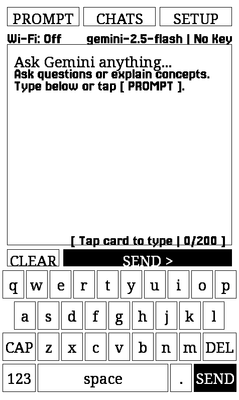

# CrossInk — Gemini AI Edition

> **Open-source e-reader firmware with Google Gemini AI for ESP32-C3 and ESP32-S3 devices** (forked from [CrossPoint](https://github.com/crosspoint-reader/crosspoint-reader) / [uxjulia/CrossInk](https://github.com/uxjulia/CrossInk)).  
> Enhanced with **Google Gemini AI**, **iPhone-style on-screen keyboard**, **Notes with live Wi-Fi typing**, **Anki/FSRS flashcard study**, **Starred books**, **Dark mode scheduling**, custom typography, and lightweight reading statistics.

[](https://github.com/helloworldkr/CrossInk-Gemini-AI)
[](https://platformio.org/)

---

### Supported Devices

- **Xteink X3 / X4 / X4 Classic** (ESP32-C3, physical buttons, 800×480 E-Ink)
- **Xteink X4 Pro** (ESP32-S3, capacitive touch, SDMMC, PSRAM, USB drive)
- **Seeed Studio reTerminal Sticky** (ESP32-S3, capacitive touch, PSRAM)
- **Desktop Simulator** (macOS, Linux)

---

## 🌟 What's New in This Fork

This fork extends the firmware with powerful built-in apps, reading conveniences, and cloud intelligence while preserving e-ink battery life and memory stability on both ESP32-C3 and ESP32-S3 hardware.

### Feature Highlights

- 🤖 **Google Gemini AI Assistant**: Ask questions, explain concepts, and brainstorm directly on your e-reader screen.
- ⌨️ **Native iPhone-Style Keyboard**: Authentic 4-row touch keyboard with live on-screen typing, ready-made prompt templates, Shift, and Symbol modes.
- 📝 **Notes & Checklists**: On-device note-taking with on-screen keyboard, live phone typing over Wi-Fi (`/n`), and sleep screen pinning.
- 🎴 **Anki (Spaced Repetition & Flashcards)**: Native Anki flashcard review powered by the FSRS algorithm with Cloze deletions and image support.
- ⭐ **Starred Books & Quick Navigation**: Star/favorite books from the reader or file browser and access them instantly from the Home screen.
- 🔄 **Start from Beginning**: Restart any book from the very beginning (spine 0, page 0) with a single click.
- 📂 **Go to Book Folder**: Exit from a book directly into its containing folder in the File Browser with your reading progress saved.
- 🌙 **Automatic Dark Mode Schedule**: Auto-switch to dark mode at sunset and daylight mode in the morning.
- 🚀 **Apps Shelf**: Dedicated apps launcher on the Home screen to easily launch Gemini, Anki, and Notes.
- 🔤 **Curated Reader Typography**: Crisp built-in [Lexend Deca](https://fonts.google.com/specimen/Lexend+Deca) and [Bitter](https://fonts.google.com/specimen/Bitter) fonts with anti-aliasing and CJK/symbol support.
- 📊 **Lightweight Reading Statistics**: Real-time reading stats, session tracking, sleep screen dashboard, and device-to-device sync.

---

## 🤖 Google Gemini AI Assistant

Have an intelligent AI reading companion right on your e-reader. Ask for clarifications on complex passages, summaries, translations, or brainstorm topics without picking up your phone or computer.

<p align="center">
  
  <br>
  <em>CrossInk Gemini AI Assistant with maximized screen real estate, interactive prompt card, and 4-row touch keyboard on Xteink X4 Pro (Portrait 480×800)</em>
</p>

### How It Works

- **Live On-Screen Keyboard & Full-Screen Typing**: Type questions directly into the live prompt box using the authentic on-screen touch keyboard, or tap the prompt card to open the distraction-free full-screen keyboard with cursor control.
- **Conversational UI Stream**: Automatically transitions from the prompt card into a clean threaded dialogue stream with clear speaker roles (`[YOU - Turn X]` and `[GEMINI]`) and conversational pagination that automatically scrolls to the newest exchange.
- **Multi-Turn Conversations**: Tap `[ REPLY ]` on any response to ask follow-up questions and continue the conversation seamlessly with full context.
- **Save with Folder Management**: Tap `[ SAVE ]` to save the complete multi-turn conversation locally. Save to default (`/XTData/gemini_chats`), export to `/notes`, choose an existing directory, or create a new folder on the fly.
- **Resume & Load Chats**: Tap `[ RESUME ]` on the Welcome card to jump back into your active conversation, or tap `[ CHATS ]` to browse and reload previous conversations from disk with full pagination.
- **One-Tap Quick Actions & Setup**: Instant access to ready-made prompt templates via `[ PROMPT ]`, saved chat history via `[ CHATS ]`, and active model selection / Wi-Fi setup via `[ SETUP ]`.
- **Ready-Made Prompts**: Tap `[ PROMPT ]` for instant 1-tap templates (*"Summarize key ideas"*, *"Explain simply (ELI5)"*, *"Translate to clear English"*, etc.).
- **Direct Wi-Fi Inference**: Connects securely to Google's Gemini API over Wi-Fi.
- **Smart Model Engine**: Defaults to `gemini-2.5-flash` with quick model switching to `gemini-2.5-flash-lite`, `gemini-2.5-pro`, or `gemini-2.0-flash`.
- **E-Ink Paged Reading**: Long responses are cleanly formatted and paginated with simple tap/button page turns.
- **Auto-Connect**: Automatically connects to your saved Wi-Fi network when you launch the Gemini app.

### Setting Up Your API Key

1. Get a free Google Gemini API key from [Google AI Studio](https://aistudio.google.com/).
2. Insert your SD card into your computer (or mount it via USB Drive mode).
3. Create a file named `llm_token` inside the `/XTData` folder on your SD card:
   ```
   /XTData/llm_token
   ```
4. Paste your API key into this file. Any of the following formats are supported:
   - **Plain text**:
     ```
     AIzaSyYourGeminiApiKeyHere...
     ```
   - **Key/Value format**:
     ```
     key=AIzaSyYourGeminiApiKeyHere...
     ```
   - **JSON format** (allows setting a custom default model):
     ```json
     {
       "key": "AIzaSyYourGeminiApiKeyHere...",
       "model": "gemini-2.5-flash"
     }
     ```
5. Launch **Apps > Gemini** from the Home screen, type your prompt using the on-screen keyboard, and tap **Send**!

> **Tip**: You can view detailed interaction logs or troubleshoot API requests in `/XTData/gemini.log`.

---

## 📝 Notes & Checklists

A lightweight, distraction-free notepad built right into your e-reader.

- **On-Device Typing**: Compose notes and to-do checklists using the touch keyboard.
- **Live Wi-Fi Phone Typing**: Open `http://<your-device-ip>/n` in your phone or laptop browser to type notes smoothly on a physical/phone keyboard in real-time.
- **Item Actions**: Tap any checklist line to edit text, mark it complete, or delete it.
- **Pin to Sleep Screen**: Pin any note or checklist to remain visible while your device is asleep—perfect for daily to-do lists, shopping lists, or reminders.

---

## 🎴 Anki (Spaced Repetition & Flashcards)

Review your Anki flashcard decks on an eye-friendly e-ink screen before bed or during commutes.

- **FSRS Algorithm**: Implements the modern Free Spaced Repetition Scheduler for optimized memory retention.
- **Card Review**: Tap or press Confirm to reveal answers, then rate retention as *Again*, *Hard*, *Good*, or *Easy*.
- **Rich Card Support**: Supports Cloze deletions (`{{c1::answer}}`), markdown formatting, and embedded illustrations.
- **Importing Decks**: Convert any existing Anki `.apkg` deck using the one-click web installer at [crossplay.ma-r-s.com/study](https://crossplay.ma-r-s.com/study/) or the included Python converter script located in [`tools_local/study/`](./tools_local/study/). See the [Anki Testing Guide](docs/anki-guide.md) for full setup and testing instructions.

---

## ⭐ Starred Books & Quick Navigation

Never lose track of your favorite books or current long reads.

- **Star While Reading**:
  - **Touch devices**: Swipe up from the bottom edge to open the drawer and tap **Star Book** / **Remove Star** under Location.
  - **Button devices**: Press Menu to open reader options and toggle **Star Book**.
- **Star From Menus**: Available in the contextual action menu across the **File Browser**, **Recent Books List**, and **Recent Books Grid**.
- **Home Screen Access**: Access all your starred books instantly from the dedicated **Starred Books (★)** button on the Home menu row.
- **Automatic Sync**: Moving or renaming books preserves star status automatically.

---

## 📖 Enhanced Reader Features

- **Start from Beginning**: Restart reading an EPUB or XTC from page 0 in a single click from the bottom drawer or reader menu.
- **Go to Book Folder**: Exit immediately from a book to its folder in the File Browser with your progress saved and the book highlighted.
- **Focus Reading & Guide Dots**: Optional reader visual guides to assist focused reading.
- **Force Paragraph Indents**: Cleanly formats books that were published as unbroken walls of text.
- **Reading Statistics**: Live metrics for reading time, books completed, pages turned, and average session pace.
- **Dark Mode Schedule**: Configure automated dark mode under **Settings > Display > Dark Mode Schedule**.

---

## 🔤 Reader Fonts & Typography

The default typography is optimized for 1-bit and grayscale e-ink rendering:

- **[Lexend Deca](https://fonts.google.com/specimen/Lexend+Deca)**: Designed to enhance reading fluency and reduce visual crowding.
- **[Bitter](https://fonts.google.com/specimen/Bitter)**: Contemporary slab serif with consistent stroke weights for clear contrast on e-ink.
- **[Inter](https://fonts.google.com/specimen/Inter)**: High-legibility UI font for menus, status bars, and dialogs.
- **Music & Supplemental Glyphs**: Integrated musical notation and CJK fallback ranges (reads *Project Hail Mary* flawlessly).
- **Custom Font Sizes**: 10 pt, 12 pt, 14 pt, and 16 pt with custom SD card font expansion support.

---

## 💡 Best Practices for E-Ink Performance

The ESP32 microcontroller balances battery efficiency with responsive reading:

- **Folder Sizing**: Keep directories under 200 files (50–100 files per folder is optimal).
- **Organization**: Group large libraries into subfolders by author, genre, or series rather than placing hundreds of files in the SD card root.
- **EPUB Optimization**: Text-first EPUBs under 20 MB load fastest. For image-heavy or omnibus books, optimize them using the built-in web portal tool before loading.

---

## 🛠️ Building & Development

CrossInk uses [PlatformIO](https://platformio.org/) for building and flashing firmware.

### Prerequisites

- Python 3.10+
- PlatformIO Core (`pio`)
- Git with submodules initialized

### 1. Initialize Submodules

```sh
git submodule update --init --recursive
```

### 2. Build & Flash for Your Target

| Device / Target | Hardware Profile | Build Only | Build & Upload (USB) |
| :--- | :--- | :--- | :--- |
| **Xteink X4 Pro** | ESP32-S3, Touch, SDMMC, 8MB PSRAM, USB Drive | `pio run -e x4-pro` | `pio run -e x4-pro -t upload` |
| **Xteink X3 / X4 / Classic** | ESP32-C3, Physical Buttons, SPI SD | `pio run -e default` | `pio run -e default -t upload` |
| **Seeed reTerminal Sticky** | ESP32-S3, Touch, SPI SD, 8MB PSRAM | `pio run -e sticky` | `pio run -e sticky -t upload` |
| **Desktop Simulator** | Native macOS / Linux | `pio run -e simulator` | `pio run -e simulator -t run_simulator` |

> **Firmware Binaries**: Compiled firmware binaries are saved to `.pio/build/<env>/firmware-<env>.bin` (e.g. `.pio/build/x4-pro/firmware-x4-pro.bin`), suitable for flashing with `esptool.py` or web flashers.

### 3. Monitoring Serial Logs

To view live debug output over USB-Serial:
```sh
pio device monitor
# Or build, upload, and monitor in a single step:
pio run -e x4-pro -t upload -t monitor
```

### 4. Run Automated Smoke Tests

```sh
python3 ./scripts/run_simulator_smoke_test.py
```

---

## 📄 License & Credits

- Based on [CrossPoint Reader](https://github.com/crosspoint-reader/crosspoint-reader) and [CrossInk](https://github.com/uxjulia/CrossInk).
- Open source under the terms of the MIT license.
